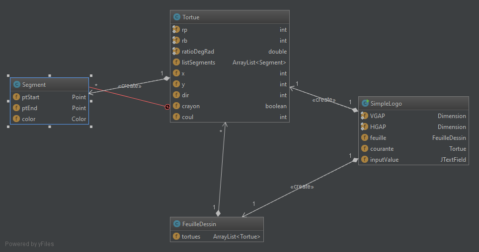
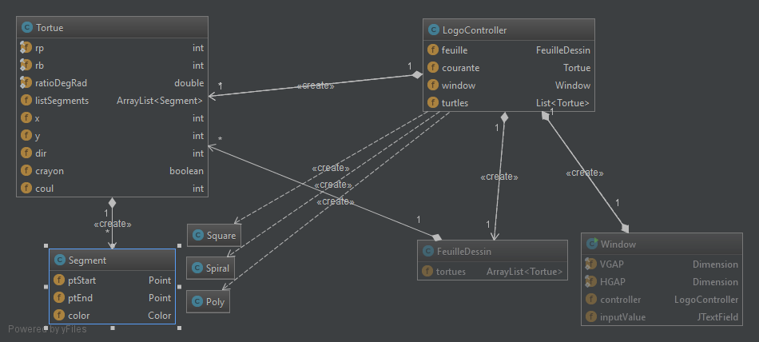

**Nom/Prénom Etudiant 1 :** DIAB Nicolas

**Nom/Prénom Etudiant 2 :** PIAT Grégoire

# Rapport TP4

## Question 1

*Diagramme de classe avant refactoring (reconstitué avec IntelliJ)*

Dans cette version de l'application, nous avons remarqué que la vue et le contrôleur sont fusionnés dans la classe tortue.controller.ManualController.

## Question 2
*Rien à rédiger*

*Diagramme de classe après refactoring (reconstitué avec IntelliJ)*

## Question 3
*Rien à rédiger*

## Question 4
*Rien à rédiger*

## Question 5
*Expliquer le code ajouté et représenter le patron de conception*

## Question 6
*Rien à rédiger*
